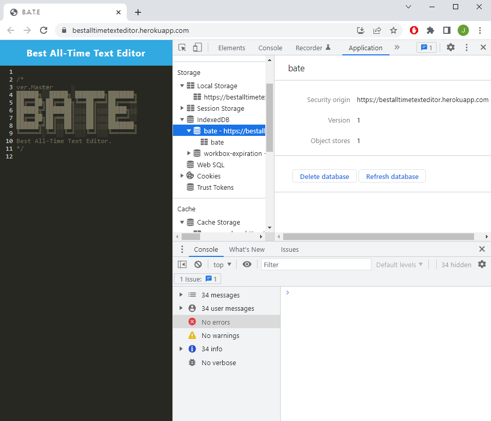

# BATE: Best-All-time-Text-Editor

## License
  
  

## Table of Contents
[Description](#description)

[Usage](#usage)

[Test](#test)

[Screenshot](#screenshot)

[Future Development](#future-development)

[Contributors](#contributors)

## Description
BATE is the Best All-time Text Editor out there! (at least to me!). It is a progressive web application that you can install on to your desktop/smartphone. It will auto-save your work to the local storage, so you can come back from where you left off. 

## Usage
This application is currently deployed on heroku! [here](https://bestalltimetexteditor.herokuapp.com/)

As long as you have internet connection, you can access the webpage for the text editor! 

Make sure you press "Install" to download the application to your desktop/homepage on mobile, and you can continue working away if you lose your internet connection. 

## Test
No testing was done for this project. 

However, please feel free to add the feature to contribute to this project or contact me for more details!

## Screenshot

## Future Development
Currently there is a known issue where the image doesn't cache on the first load. Image (logo) will only cache after the page has reloaded. 

## Contribution

    Joe Lee 2022

    Got any questions or want to contribute to this project? 

Contact me via: 

  - [Jollypong](https//:github.com/Jollypong) 

  - Email: joeleegc@gmail.com

## 